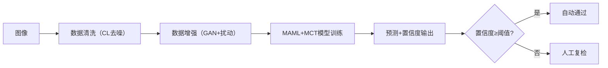

# 项目周报

**日期**：2025-6-8
**项目实践题目**：面向机器学习的数据清洗方法

## 实践内容
### 一、问题
**核心问题**：医学中稀缺疾病样本少或工业中缺陷样本少等等，传统模型易过拟合且无法可靠评估预测结果
**解决方案**：结合论文《Meta-Learned Confidence for Few-shot Learning》提出的**元学习置信度框架（MCT）**，通过输入自适应距离度量与扰动集成，实现：
*   提升小样本缺陷检测准确率；
*   输出带可靠性标签的预测结果，决策（如触发人工复检）。

### 二、文献挖掘与分析
### （一）核心文献方向
*   元学习（如 MAML）通过 “任务间知识迁移” 解决样本少问题，但缺乏对预测不确定性的建模
*   CleanLab 可识别标注噪声，但小样本场景下模型预预测不可靠，需结合元学习动态校准置信度
*   论文提出**Meta-Confidence Transduction（MCT）**，通过元学习输入自适应距离度量（Instance/Pair-wise Metric）和扰动集成（模型 / 数据扰动），提升小样本置信度可靠性

### （二）关键工具与代码
*   **学术资源**：
    *   核心方法：MCT 框架
    *   代码库：GitHub论文开源实现（[https://github.com/seongmin-kye/MCT](https://github.com/seongmin-kye/MCT)）。

### 三、方案
### 1：数据处理（CL清洗）
#### 步骤 1：数据集
使用简单CIFAR-10数据集模拟，包含10个类别，每个类别包含5000张32x32的彩色图像.
每个类别随机抽取10张图像为小样本

#### 步骤 2：CL 标注噪声清洗（结合论文预训练模型）
*   **工具**：CleanLab+预训练模型（ResNet18）。
*   **输出**：标注错误样本，人工修正或使用伪标签。

#### 步骤 3：数据增强（GAN + 扰动策略）
*   **基础增强**：StyleGAN2
*   **扰动增强**：
    *   **数据扰动**：对生成样本应用“弱-强”增强（支持集弱翻转，查询集强噪声 + 裁剪）
    *   **模型扰动**：训练时随机丢弃 ResNet 最后一个残差块

### 2：模型设计（MCT + 元学习）
#### 步骤 1：元学习框架选择
*   **主干网络**：MAML + 轻量级CNN
*   **特征提取**：输出高维嵌入（如 16×8×8 特征图），保留空间位置信息用于定位
#### 步骤 2：嵌入 MCT 置信度模块&#xA;
*   **输入自适应距离度量**：
    * **实例级度量**：对每个样本计算尺度参数 
      $$
      g_\phi^I
      $$
$$
d_\phi^I(a_1, a_2) = \left\| \frac{a_1 / \|a_1\|_2}{g_\phi^I(a_1)} - \frac{a_2 / \|a_2\|_2}{g_\phi^I(a_2)} \right\|_2^2
$$

* 实现：CNN + 全连接层，输入特征图，输出 
  $$
  g_\phi^I \in (0,1)
  $$

* **成对度量**：计算样本对共享尺度 
  $$
  g_\phi^P(a_1, a_2)
  $$

*   **扰动集成置信度**：
    
    *   训练时随机应用模型扰动（Drop-path）和数据扰动（水平翻转），测试时集成多扰动结果：
$$
q_c^{(T)}(\tilde{x}) = \frac{1}{4} \left( q_{\text{full}} + q_{\text{drop-path}} + q_{\text{flip}} + q_{\text{drop-path+flip}} \right)  
$$

### 流程图
